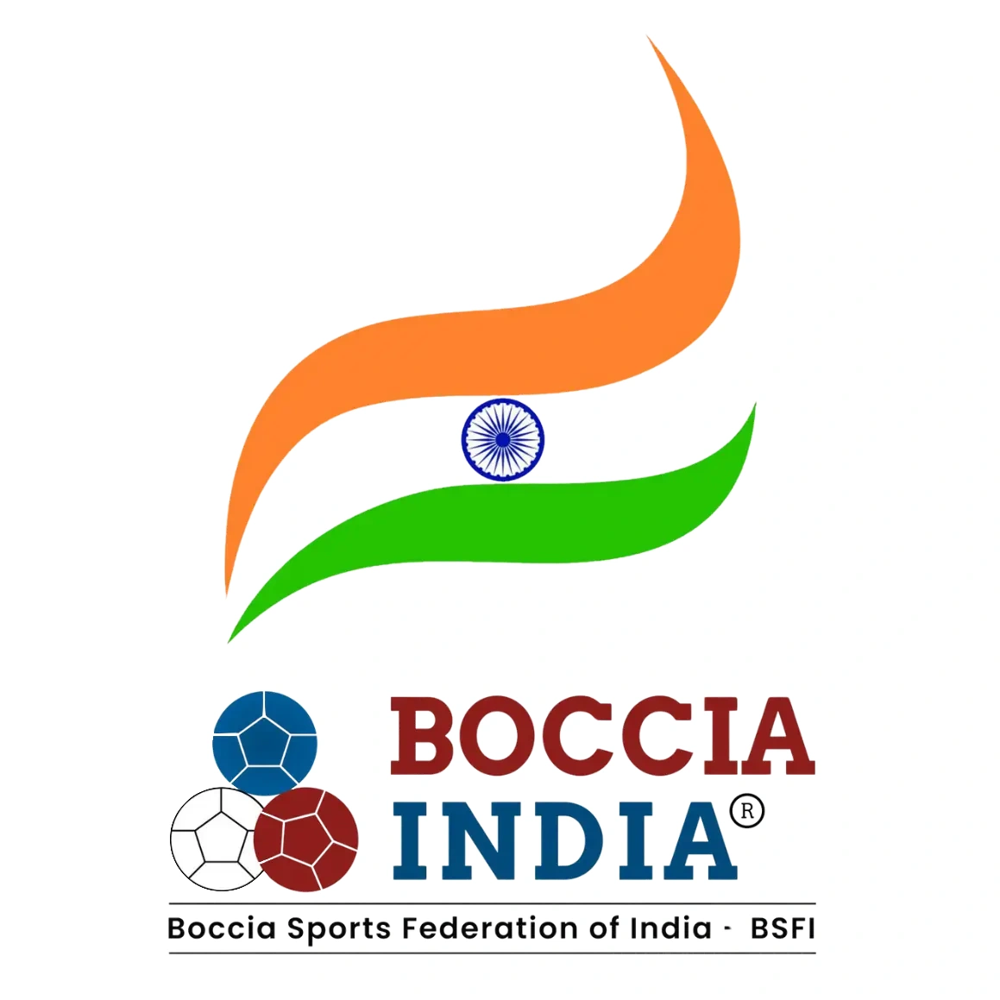
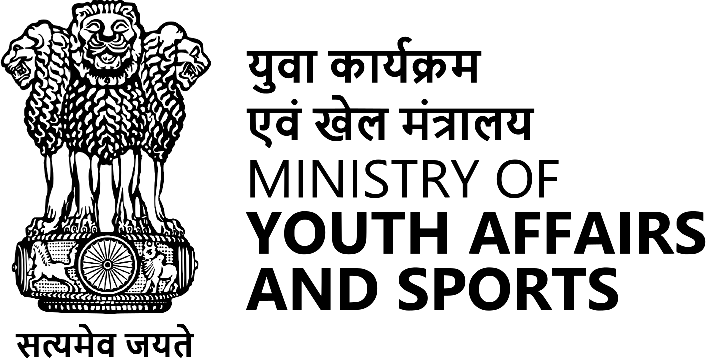
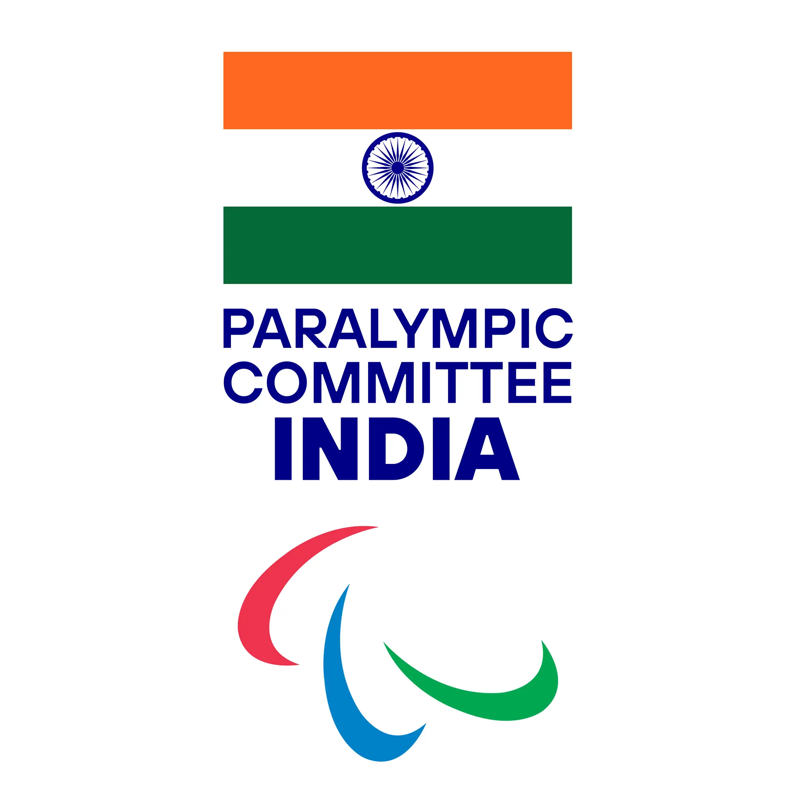
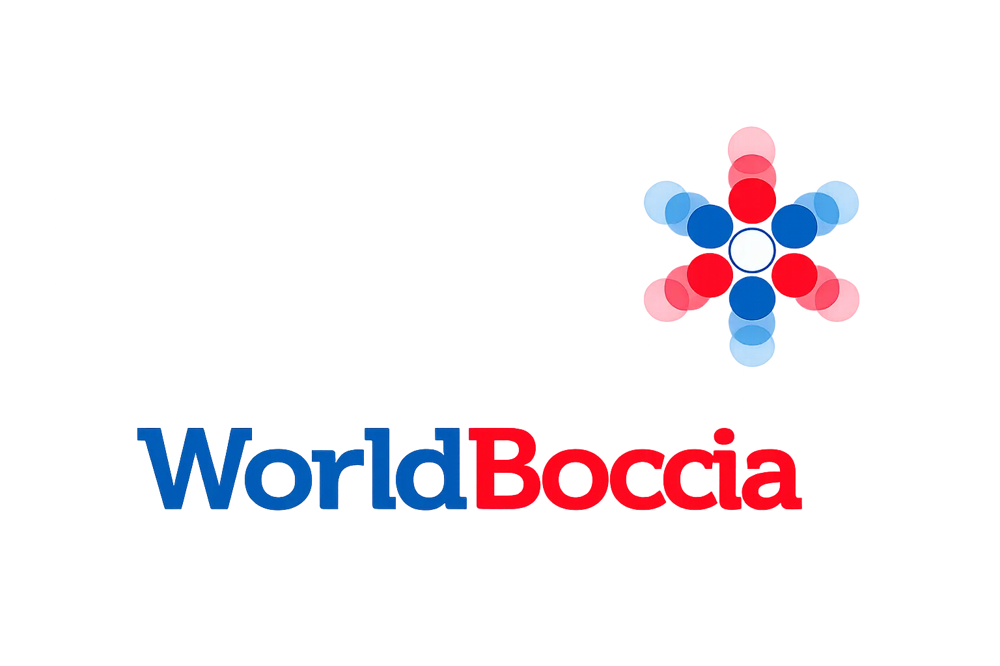
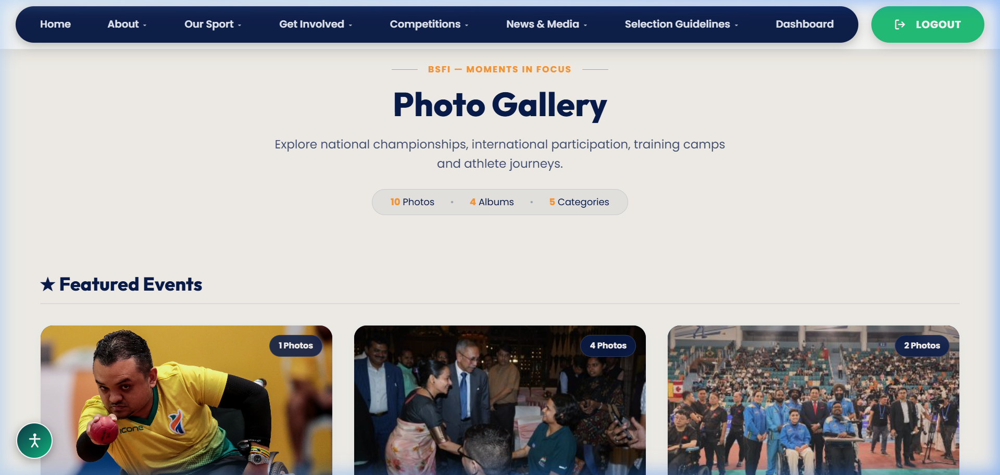
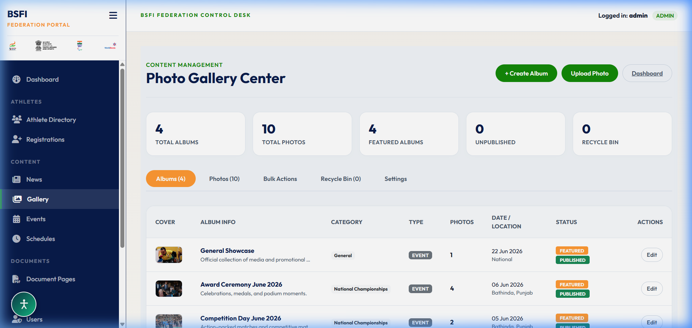

# Boccia India - Official Web Portal & CMS (BSFI)

An enterprise-grade sports management system and public portal custom-developed for the **Boccia Sports Federation of India (BSFI)**. BSFI is the national governing body for the sport of Boccia in India, recognized by the **Ministry of Youth Affairs and Sports (MYAS)**, and officially affiliated with the **Paralympic Committee of India (PCI)** and **World Boccia**.

---

## 🏛️ Affiliation & Official Bodies

| Boccia India (BSFI) | MYAS (Govt of India) | Paralympic Committee of India | World Boccia |
| :---: | :---: | :---: | :---: |
|  |  |  |  |
| **National Federation** | **Recognized Ministry** | **Paralympic Affiliate** | **International Body** |

> [!IMPORTANT]
> **PROPRIETARY & COMMERCIAL PROJECT**
> This repository is a fully custom, paid project commissioned by **BOCCIA INDIA (Boccia Sports Federation of India)**. All code, design systems, layouts, and database schemas are proprietary. Unauthorized copying, distribution, or modifications of this project are strictly prohibited.

---

## 🌟 Boccia as an Initiative in India

**Boccia** is a precision target ball sport, similar to bocce, designed specifically for athletes with severe physical disabilities, particularly Cerebral Palsy, Muscular Dystrophy, Spinal Cord Injuries, and other neurological conditions. 

### The BSFI Mission
Through the official portal and registry, the Boccia Sports Federation of India is leading several key initiatives:
1.  **Grassroots Inclusion & Outreach**: Actively identifying and registering para-athletes in all states and union territories, providing them a competitive platform.
2.  **Specialized Classification Registry**: Managing athletic classifications (BC1, BC2, BC3, BC4, BC5) to ensure fair competition. For BC3 athletes, specialized ramps and ramp assistants are regulated and audited.
3.  **Pathways to Paralympics**: Creating structured local, state, and national schedules that link directly to World Boccia international events, paving the way for Indian representation at the Paralympic Games.
4.  **Anti-Doping Compliance (NADA/WADA)**: Promoting clean sport by organizing training materials and guidelines readily accessible through the portal.

---

## 📸 Website Highlights

### 1. Public Gallery & Album Viewer
A premium, responsive album grid featuring category filters and horizontal swipe navigation on mobile viewports. Clicking an album transitions into a beautiful masonry layout with an integrated media lightbox.


### 2. Admin Control Desk Dashboard
A centralized system dashboard showing real-time statistics (total registrations, classifications, missing athlete metadata), timeline logs, and quick actions.


---

## ⚙️ Key Technical Features

### 💻 Public Web Portal
*   **Accessible Design System**: Tailored HSL color palette and accessibility controls (contrast toggle, text magnifier, NADA/WADA compliant layouts).
*   **Dynamic Interactive Map**: SVG-based state map reflecting live athlete registration density across India.
*   **Media Center Archive**: Structured **Category ➔ Album ➔ Photo** organization matching professional athletic federations.
*   **Online Registration**: Custom forms for Athletes and Officials with data sanitization, profile completeness scoring, and security checks.

### 🛡️ Administrative CMS (Control Desk)
*   **Metrics Dashboard**: Live KPI cards detailing missing files, status of registries, and database health.
*   **Role-Based Security**: Restrictive authentication layers separating Administrators, Editors, and Viewers.
*   **Bulk Sync & Data Import**: Deduplicated folder scanning, EXIF stripping, and Excel/CSV parsing helpers.
*   **Audit Trail & Safeguards**: Comprehensive log tracking of staff activity and database backups.

---

## ⚖️ Legal & Compliance Structure

### 1. Trademark & IP Notice
All trademarks, logo marks, and official documents of **BOCCIA INDIA**, **BSFI**, **MYAS**, **PCI**, and **World Boccia** are legally protected. This software is built in accordance with the official guidelines of:
- **Ministry of Youth Affairs & Sports (MYAS)**, Government of India.
- **Paralympic Committee of India (PCI)**.
- **World Boccia (International Boccia Sports Federation)**.

### 2. Athlete Privacy
All athlete registry details, medical classifications, and sensitive documents are stored securely. Personal Identifiable Information (PII) is encrypted and accessed exclusively by authorized executive officers.

---

## 🚀 Setup & Execution

### Prerequisites
- PHP 8.0 or higher
- MySQL 5.7 or higher
- Web server (Apache, Nginx, or XAMPP suite)

### Installation
1.  Clone the repository into your server root directory.
2.  Import the database structure from the `schema.sql` file:
    ```sql
    mysql -u [user] -p [database_name] < schema.sql
    ```
3.  Configure your credentials in `includes/db.php`:
    ```php
    $host = 'localhost';
    $db   = 'your_database';
    $user = 'your_username';
    $pass = 'your_password';
    ```
4.  Launch your local PHP development server or run XAMPP.

---

## 📄 License
Copyright © 2026 **Boccia Sports Federation of India (BSFI)**. All rights reserved. 
Licensed exclusively for deployment on the official Boccia India domains.
